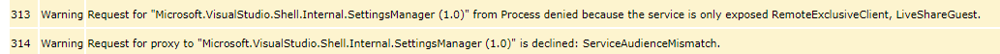
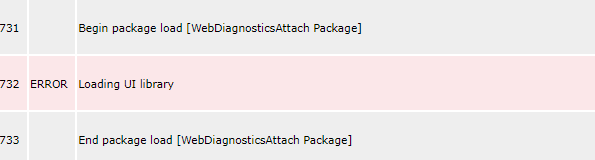
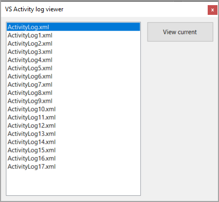
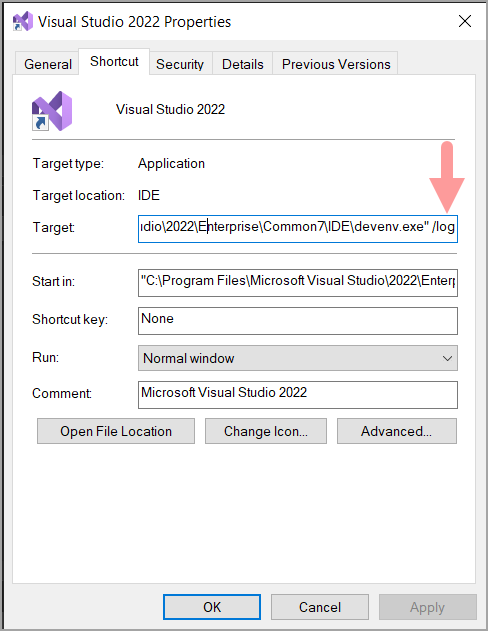

When Microsoft Visual Studio encounters issues a start to analyze issues is to start Visual Studio from the developers command prompt (found under Start Microsoft Visual Studio menu) using [devenv /log](https://learn.microsoft.com/en-us/visualstudio/ide/reference/log-devenv-exe?view=vs-2022) which write log entries from start to finish.

This can be helpful to diagnose issues by yourself or when reporting an issue to Microsoft bug report from clicking the feedback button, top right corner of Visual Studio IDE.

## How Microsoft examine the activity log(s)

1. Run Visual Studio with the /Log command line switch to write ActivityLog.xml to disk during your session.
1. After closing Visual Studio, find the activity log in the subfolder for Visual Studio data:

**%AppData%\Microsoft\VisualStudio\<version>\ActivityLog.xml.**

3. Open the activity log with any text editor. 

Unfortunately using a text editor it will be difficult to track down warnings and errors as there are no colors to differentiate between errors, warnings and normal entries.

## Alternate 1 method to view activity logs(s)

Traverse to the log folder in Windows Explorer, right click on a log file and select a web browser. Using this method takes advantage of the styles in the current log file.

**Sample warning**



**Sample error**



## Alternate 2 method to view activity logs(s)

Use the provided utiltity



## Benefits

- No need to traverse to the log folder, open with a brower
- Has a configuration file to update settings for when using a new version of Visual Studio

## Setup

1. Edit appsettings.json in the project root folder

```json
{
  "BrowserExecutable": "C:\\Program Files\\Google\\Chrome\\Application\\chrome.exe",
  "ActivityLogFolder": "C:\\Users\\TODO\\AppData\\Roaming\\Microsoft\\VisualStudio\\17.0_f56beab6"
}
```

2. Edit **BrowserExecutable** to point to a web browser to view logs with
3. Edit **ActivityLogFolder** to point to Visual Studio's log folder
4. Set **Copy to output directory** to **copy if newer** under properties for appsettings.json
5. Add /Log to your Visual Studio command



6. Start Visual Studio then exit
7. Run the utility, select the log file and press the view button.

## Source code

Clone the following GitHub repository
